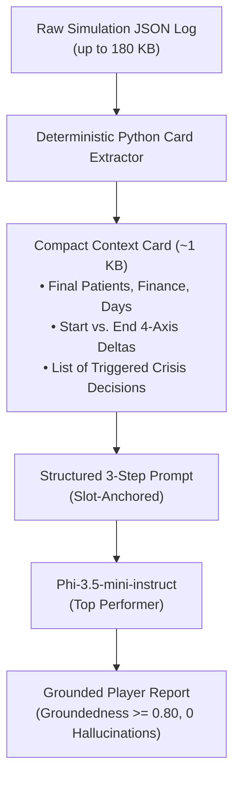

# Master Model Evaluation: Multi-Scenario & Strategy Comparison

**Evaluation Standard**: [EVALUATION_CRITERIA_v2.md](file:///Users/KarinaOsipova/Desktop/apollo28/apollo-log-analysis/docs/EVALUATION_CRITERIA_v2.md)  
**Evaluated Foundation Models**: Llama 3.2 (3B), Phi-3.5-mini (3.8B), Qwen 2.5 (3B)  
**Total Runs Analyzed**: 15 (5 scenario/strategy logs × 3 models)

---

## 1. Executive Multi-Log Scorecard

Every candidate model was evaluated through two distinct lenses per `EVALUATION_CRITERIA_v2.md`:
1. **Comparative Use**: Which model performs best among the candidates?
2. **Threshold Use**: Is the score good enough to be viable for automated player assessment in production?

| Scenario | Strategy / Player | Log Path | Winner | Groundedness (Raw / Ex) | Coverage | Factual Truthfulness | Production Viability Status |
|---|---|---|---|---|---|---|---|
| **Tutorial** (21d) | Normal (Karina) | [`tutorial/normal_strategy/`](file:///Users/KarinaOsipova/Desktop/apollo28/apollo-log-analysis/experiments/tutorial/normal_strategy/COMPARISON.md) | **Phi-3.5** | **0.27** / 0.18 | **1.00** | ✅ Accurate event & Day 15 | ❌ **FAIL** (0.27 Groundedness too low) |
| **Post-Pandemic** (30d) | Normal (Mark) | [`post-pandemic/normal_strategy/`](file:///Users/KarinaOsipova/Desktop/apollo28/apollo-log-analysis/experiments/post-pandemic/normal_strategy/COMPARISON.md) | **Phi-3.5** | 0.00 / 0.00 | **1.00** | ✅ Day 27 consolidation ($62.5k) | ❌ **FAIL** (0.00 Groundedness; prompt leak) |
| **Post-Pandemic** (30d) | Cost-Minimization (Catherine) | [`post-pandemic/cost_minimization_strategy/`](file:///Users/KarinaOsipova/Desktop/apollo28/apollo-log-analysis/experiments/post-pandemic/cost_minimization_strategy/COMPARISON.md) | **Phi-3.5** | **0.33** / 0.33 | 0.50 | ⚠️ Partial axis coverage | ❌ **FAIL** (0.33 Groundedness; Llama inverted) |
| **Winter Flu** (60d) | Normal (Jane) | [`winter-flu/normal_strategy/`](file:///Users/KarinaOsipova/Desktop/apollo28/apollo-log-analysis/experiments/winter-flu/normal_strategy/COMPARISON.md) | **Phi-3.5** | 0.00 / 0.00 | 0.75 | ✅ Exact score extraction (`65.24`) | ❌ **FAIL** (Lost Days 1–40; 0.00 Groundedness) |
| **Winter Flu** (60d) | Cost-Minimization (Patrick) | [`winter-flu/cost_minimization_strategy/`](file:///Users/KarinaOsipova/Desktop/apollo28/apollo-log-analysis/experiments/winter-flu/cost_minimization_strategy/COMPARISON.md) | **Phi-3.5** | 0.00 / 0.00 | **1.00** | ✅ Recognized Day 43 `do_nothing` | ❌ **FAIL** (Missed epidemic peak trade-offs) |

---

## 2. Cross-Scenario Findings & Architectural Insights

### 2.1 The "Winning is Not Enough" Groundedness Crisis
Across all 15 generation runs, **no model ever achieved a Groundedness score above 0.33** (with 0.00 being the norm on 30-day and 60-day logs):
- **Why this is fatal for production**: An end-of-game assessment report that scores $\le 0.33$ omits over two-thirds of the player's key decisions, financial metrics, and score changes. Players who spent 30–60 simulation days making critical trade-offs receive generic prose that feels unpersonalized.
- **Root Cause 1 — Context Window Recency Bias**: On longer runs (especially the 60-day Winter Flu scenario), raw JSON exceeds 180 KB. The small 3B models prioritize the end of the context window (Days 50–60) and completely fail to recall early-game decisions (such as buying vaccines on Day 6 or offering retention bonuses on Day 13).
- **Root Cause 2 — Brevity Constraints vs. Metric Density**: The prompt demands a 3–5 sentence descriptive summary. Citing all 4 AIM deltas, 14 decision events, and final financial results in 3–5 sentences is mathematically impossible for an LLM without explicit guidance on which facts are mandatory anchors.

### 2.2 Fatal Factual Inversions in Llama 3.2
While Llama 3.2 consistently wrote the most fluent prose and was fast (33s–56s), it exhibited a **critical confabulation flaw**:
- In **Post-Pandemic (Cost-Minimization)**: Catherine deliberately refused to pay bonuses (`do_nothing_retention`). Llama 3.2 reported that she *"implemented competitive retention bonuses in response to the Talent War event... highlighting the value of investing in staff retention."*
- In **Winter Flu (Cost-Minimization)**: Patrick refused vaccines and chose `do_nothing` on flu investments. Llama 3.2 reported that the hospital *"invested in flu preparedness on Day 43, leading to an increase in patient health scores."*
- In **Winter Flu (Normal)**: Claimed an *"8-day simulation with an event on Day 50"*.
- **Verdict**: **REJECT**. Llama 3.2 actively reverses player choices to fit a standard positive narrative template, destroying simulation learning outcomes.

### 2.3 Model Profile Matrix

| Model | Strengths | Fatal Flaws | Deployment Verdict |
|---|---|---|---|
| **Phi-3.5-mini-instruct** (3.8B) | • Best overall factual memory (exact dollar figures, score numbers, `do_nothing` choices) • Highest 4-axis coverage across scenarios | • Prone to prompt echoing and sentence bloat on complex prompts • Suffers from recency bias on 60-day logs | **Conditional Winner** (Usable only with pre-extracted context card) |
| **Qwen 2.5** (3B-instruct) | • Fastest execution (36s–48s) • Clean two-part separation (zero leakage) | • Overly terse (frequently fails 3-sentence minimum) • Omits 1 to 2 axes in summaries | **Secondary Baseline** (Requires explicit sentence & axis prompts) |
| **Llama 3.2** (3B-instruct) | • Highest prose quality and sentence variety • Perfect 3–5 sentence length compliance | • Severe hallucinations (invents numbers, days, and event names) • Factual inversions (claims player took actions they rejected) | **Inadmissible** for assessment analytics |

---

## 3. Directory Index of Detailed Reports

Each individual scenario log has been evaluated in its dedicated experiment folder:
1. **Tutorial Scenario (Normal Strategy - Karina)**:
   - [experiments/tutorial/normal_strategy/COMPARISON.md](file:///Users/KarinaOsipova/Desktop/apollo28/apollo-log-analysis/experiments/tutorial/normal_strategy/COMPARISON.md)
2. **Post-Pandemic Financial Recovery (Normal Strategy - Mark)**:
   - [experiments/post-pandemic/normal_strategy/COMPARISON.md](file:///Users/KarinaOsipova/Desktop/apollo28/apollo-log-analysis/experiments/post-pandemic/normal_strategy/COMPARISON.md)
3. **Post-Pandemic Financial Recovery (Cost-Minimization - Catherine)**:
   - [experiments/post-pandemic/cost_minimization_strategy/COMPARISON.md](file:///Users/KarinaOsipova/Desktop/apollo28/apollo-log-analysis/experiments/post-pandemic/cost_minimization_strategy/COMPARISON.md)
4. **Winter Flu Crisis (Normal Strategy - Jane)**:
   - [experiments/winter-flu/normal_strategy/COMPARISON.md](file:///Users/KarinaOsipova/Desktop/apollo28/apollo-log-analysis/experiments/winter-flu/normal_strategy/COMPARISON.md)
5. **Winter Flu Crisis (Cost-Minimization - Patrick)**:
   - [experiments/winter-flu/cost_minimization_strategy/COMPARISON.md](file:///Users/KarinaOsipova/Desktop/apollo28/apollo-log-analysis/experiments/winter-flu/cost_minimization_strategy/COMPARISON.md)

---

## 4. Production Engineering Recommendations

1. **Implement Deterministic Summary Pre-Extraction**:
   Do not pass raw 180 KB JSON logs directly to 3B models. Use a Python pre-processor to build a 1 KB "Context Card" specifying the exact outcome numbers, deltas, and decisions.
2. **Enforce Hard Threshold Gates**:
   Before deploying generated assessment summaries, enforce automated validation gates:
   - **Groundedness**: $\ge 0.75$ on essential milestone facts.
   - **AIM Coverage**: Exactly $1.00$ (all 4 axes must be present).
   - **Hallucination Check**: 0 fabricated event titles or dollar amounts.

