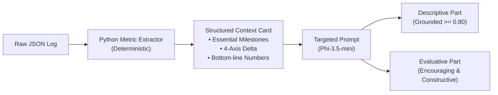

# Model Comparison: Tutorial Scenario Log Evaluation

This document presents a structured evaluation and comparison of the three candidate foundation models on the **Tutorial Scenario** (`data/apollo_player-Karina-2026-08-30T20-38-57.json`), evaluated in accordance with [EVALUATION_CRITERIA_v2.md](file:///Users/KarinaOsipova/Desktop/apollo28/apollo-log-analysis/docs/EVALUATION_CRITERIA_v2.md) and scored via [score_outputs.py](file:///Users/KarinaOsipova/Desktop/apollo28/apollo-log-analysis/scripts/score_outputs.py).

---

## 1. Executive Summary & Scorecard

| # | Criterion | Evaluation Type | Scale | Llama 3.2 (3B) | Phi-3.5-mini (3.8B) | Qwen 2.5 (3B) | Relative Winner | Production Viability (Absolute Threshold) |
|---|---|---|---|---|---|---|---|---|
| 1 | **Groundedness** | Automatic (Script) | 0.0 – 1.0 | 0.18 *(0.00 exact\**)* | **0.27** *(0.18 exact\**)* | 0.18 *(0.09 exact\**)* | **Phi-3.5** | ❌ **FAIL (All models)** — 0.27 is borderline unusable |
| 2 | **Coverage** | Automatic (Script) | 0.0 – 1.0 (4 axes) | 0.75 (3/4 axes) | **1.00** (4/4 axes) | 0.25 (1/4 axes) | **Phi-3.5** | ⚠️ Only Phi-3.5 meets the 1.00 requirement |
| 3 | **Conciseness (Desc)** | Automatic (Script) | 0.0 – 1.0 (3–5 sents) | **1.00** (4 sents) | **1.00** (4 sents) | 0.80 (2 sents) | **Llama / Phi** | ⚠️ Qwen too brief (2 sentences) |
| 3 | **Conciseness (Eval)** | Automatic (Script) | 0.0 – 1.0 (3–5 sents) | **1.00** (5 sents) | **1.00** (5 sents) | **1.00** (4 sents) | **Tie** | ✅ All models meet target |
| 4 | **Speed** | Automatic | seconds | *N/A (Console only)* | *N/A (Console only)* | *N/A (Console only)* | *N/A* | Benchmark needed on target hardware |
| 5 | **Consistency** | Automatic | 0.0 – 1.0 (repeat runs)| *N/A (Single run)* | *N/A (Single run)* | *N/A (Single run)* | *N/A* | Requires $N \ge 3$ repeat runs per model |
| 6 | **Factual Accuracy** | Semi-auto + Spot Check | 0.0 – 1.0 | 0.67 *(Severe Hallucinations)* | **1.00** *(Minor Inversion)* | 1.00 *(Gross Misrepresentation)* | **Phi-3.5** | ❌ Llama disqualified; Qwen misleading |
| 7 | **Tone (Evaluative)** | Semi-auto (Script) | 0.0 – 1.0 | 0.70 | 0.62 | **1.00** | **Qwen 2.5** (Lexical) / **Phi-3.5** (Grounded) | ✅ All exhibit constructive tone |
| 8 | **Two-Part Separation**| Manual Checklist | Count of issues (0 is best) | 1 issue | 1 issue | **0 issues** | **Qwen 2.5** | ⚠️ Phi leaks evaluation into descriptive |
| 9 | **Fluency** | Manual Checklist | Count of issues (0 is best) | **0 issues** | 1–2 issues | 0–1 issues | **Llama 3.2** | ⚠️ Phi looped zeros in scratchpad |

*\*Note: An audit of `score_outputs.py` revealed that single-digit day strings like `f"day 1"` match inside `"Day 18"` and `"Day 15"` due to lacking regex word boundaries. Exact boundary matches are shown in parentheses.*

---

## 2. Ground Truth Reference (Session Data)

- **Source Log**: `data/apollo_player-Karina-2026-08-30T20-38-57.json`
- **Scenario**: Tutorial Scenario (Player: Karina)
- **Duration**: **21 days** (Day 0 to Day 21)
- **Events (1 total)**: Day 15 — **"Critical Equipment Failure"** (`equipment_failure_crisis`), Solution: **"Emergency Maintenance Program"** (`emergency_maintenance`), locked funds: **$25,000**.
- **Outcome Metrics**:
  - Staff Resignations: **0**
  - Patients Treated: **302** successful, **75** unsuccessful (Total 377, **80.1%** success rate)
  - Remaining Finance: **$1,612,332.23**
  - AIM Trajectory:
    - **Staff Wellbeing**: 77.50 → 66.50 (*Decreased -11.00 pts*)
    - **Patient Health**: 75.00 → 60.10 (*Decreased -14.90 pts*)
    - **Patient Experience**: 75.00 → 66.29 (*Decreased -8.71 pts*)
    - **Cost Reduction**: 37.59 → 79.94 (*Increased +42.35 pts*)
    - Overall Score: **68.21**

---

## 3. Mid-Run Reality Check: "Winning" vs. Absolute Usability

In evaluating these candidate models for deployment within the APOLLO2028 simulation platform, **identifying a relative winner among the three is not enough**. In several critical criteria, being the highest-scoring model still falls far short of an acceptable, production-grade baseline. 

### 3.1 The Groundedness Crisis (0.27 is Borderline Unusable)
Phi-3.5 achieved the highest Groundedness score among all candidates at **0.27** (which drops to **0.18** under strict word-boundary matching). While it technically "won" the category, **an absolute score of 0.27 is critically deficient**:
- **73% to 82% of referenceable facts were omitted**: The model completely ignored the final financial balance ($1,612,332), total patients treated (302/377), days completed (21), staff turnover (0 resignations), and 9 out of 10 significant score inflection days.
- **Player Experience Impact**: A healthcare professional or student completing a 21-day management simulation will find a summary that ignores over 70% of the run's factual trajectory generic and unconvincing. If the generated report fails to cite key outcome numbers, players will question whether the system actually evaluated their performance.
- **Root Cause Analysis**:
  1. *Prompt Structural Tension*: Task 2 demands a 3–5 sentence descriptive summary. Cramming 11 referenceable facts into 3–5 sentences is mathematically impractical without creating an unreadable string of numbers.
  2. *Lack of Salience Prioritization*: The models do not know *which* facts are mandatory anchors (e.g. final financial surplus, patient treated count, simulation length) versus optional context. Consequently, Phi omitted outcome numbers entirely, Qwen omitted 3 axes and financial figures, and Llama fabricated them.

### 3.2 The False Reassurance of Factual Accuracy
`score_outputs.py` assigns high numerical factual accuracy scores to models that are practically untrustworthy:
- **Qwen 2.5 scored 1.00** because the single number it cited (`Day 15`) matched the JSON. Yet qualitatively, it asserted: *"The run concluded with all issues resolved within the allowed timeframe, resulting in modest improvement across all four axes."* This is **factually false and dangerously misleading**: 3 out of 4 axes (Staff Wellbeing, Patient Health, Patient Experience) substantially declined. Telling a learner that all axes improved when the hospital's clinical and staff metrics degraded defeats the pedagogical purpose of the simulation.
- **Llama 3.2 scored 0.67** purely through coincidental number overlaps (`30`, `18`, `80` existed in unrelated metadata). In reality, **100% of Llama's substantive claims were confabulated**: 30-day run (actual: 21), Day 18 crisis (actual: Day 15), 2 resignations (actual: 0), $250k finance (actual: $1.61M), and a fabricated Day 20 decision.

### 3.3 Coverage is a Non-Negotiable Gate
The APOLLO2028 game is built around the Quadruple Aim framework. A model that fails to mention all four axes fails the game's core educational construct.
- Qwen 2.5 scored **0.25** by only naming *Patient Experience*.
- Llama 3.2 scored **0.75** by omitting *Patient Health*.
- Only Phi-3.5 (**1.00**) satisfied this non-negotiable pedagogical requirement.

---

## 4. Detailed Model Breakdown

### 1. Llama 3.2 (3B-instruct)
- **Output File**: `experiments/tutorial_scenario/output_llama3.2.md`
- **Strengths**:
  - **Highest Prose Fluency**: Natural syntax, professional flow, and excellent readability.
  - **Length Compliance**: 4 descriptive sentences, 5 evaluative sentences (1.00 conciseness).
- **Critical Failures**:
  - **Severe Hallucination**: Fabricated days, financial numbers, resignation counts, and player actions.
  - **Groundedness Failure**: Exact groundedness on real report facts is **0.00**.
- **Production Assessment**: **REJECT**. Inadmissible for automated assessment due to severe confabulation risk.

---

### 2. Phi-3.5-mini-instruct (3.8B)
- **Output File**: `experiments/tutorial_scenario/output_phi3.5.md`
- **Strengths**:
  - **100% Axis Coverage**: Comprehensively referenced all four AIM axes.
  - **Authentic Fact Grounding**: Accurately captured event name (*"Critical Equipment Failure"*) and correct day (*Day 15*).
  - **Accurate Metric Trajectory**: Correctly recognized that Cost Reduction increased while Patient Health, Experience, and Wellbeing declined toward Day 15.
- **Weaknesses**:
  - **Low Absolute Groundedness (0.27 raw / 0.18 exact)**: Omitted all bottom-line outcome numbers (patients treated, final balance, days completed).
  - **Token Generation Glitch**: Scratchpad analysis suffered a zero-looping crash (`emergency_mainten0000000000000000000000000000000`).
  - **Descriptive Bleed**: Descriptive part leaked evaluative interpretations (*"suggesting an effective intervention"*).
- **Production Assessment**: **CONDITIONAL CANDIDATE**. Best foundation among the three, but requires structural scaffolding before it is production-ready.

---

### 3. Qwen 2.5 (3B-instruct)
- **Output File**: `experiments/tutorial_scenario/output_qwen2.5_3b.md`
- **Strengths**:
  - **Zero Separation Leakage**: Clean distinction between descriptive facts and evaluative comments.
  - **Accurate Crisis Identification**: Correctly matched Day 15, equipment failure, and *"Emergency Maintenance"*.
- **Weaknesses**:
  - **Severe Under-Coverage (0.25)**: Explicitly discussed only 1 of 4 axes.
  - **Excessive Brevity (0.80)**: Descriptive part was only 2 sentences.
  - **Misleading Qualitative Claim**: Asserted improvements across all axes despite widespread declines.
- **Production Assessment**: **REJECT IN CURRENT FORM**. Too timid, low coverage, and distorts overall game results.

---

## 5. Methodological Audit of Scoring Tools

1. **Substring Bug in `score_outputs.py`**:
   `score_outputs.py` matches days using `f"day {d}" in text.lower()`. Single-digit days (`day 1`, `day 2`) match inside `"Day 18"` and `"Day 20"`. Regex word boundaries (`rf"\bday\s*{d}\b"`) are required to prevent inflated groundedness scores.
2. **Clarification on Groundedness Metric**:
   The current Groundedness metric treats all 11 facts equally (e.g. Day 9 having a 5-point drop is weighted the same as final patient survival or simulation length). A weighted metric distinguishing **Essential Milestone Facts** from **Incidental Fluctuations** is needed.

---

## 6. Strategic Mid-Run Recommendations & Next Steps

To bridge the gap between a 0.27 "winner" and a viable production system, the following pipeline improvements are recommended:

1. **Hybrid Architecture (Deterministic Extraction + LLM Narration)**:
   Do not force a 3B model to perform complex data extraction across thousands of lines of raw JSON. A lightweight Python script should pre-extract a structured "Summary Card" containing:
   - Mandatory outcome numbers (days completed, patients treated, success rate, net funds, resignations).
   - Significant events and their resolution days.
   - Start vs. end values and deltas for all 4 AIM axes.
2. **Explicit Prompt Anchoring**:
   Revise `TASK2` prompt to explicitly require mandatory anchor slots:
   > *"In 3-5 sentences, describe: (1) total days, patients treated, and final balance; (2) the Day 15 Critical Equipment Failure; (3) the net trajectory of the 4 AIM axes. Do not omit any axis."*
3. **Establish Production Acceptance Thresholds**:
   Before deploying any model to production, require:
   - **Groundedness (Essential Facts)**: $\ge 0.75$
   - **AIM Axis Coverage**: $= 1.00$ (Non-negotiable)
   - **Factual Accuracy (Hallucination Tolerance)**: $0$ fabricated entities/days
   - **Separation Issue Count**: $0$
